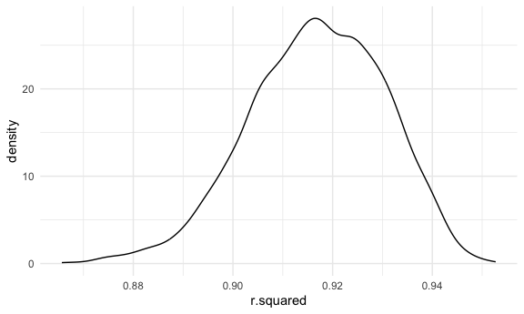
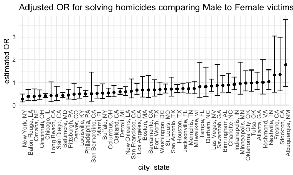

p8105_hw6_sdc2157
================
Stephanie Calluori
2023-12-02

# Load packages and set seed

``` r
library(tidyverse)
library(modelr)
library(mgcv)

set.seed(1)
```

# Problem 1

# Problem 2

## Load Central Park Weather Data

``` r
cp_weather_df <-
  rnoaa::meteo_pull_monitors(
    c("USW00094728"),
    var = c("PRCP", "TMIN", "TMAX"), 
    date_min = "2022-01-01",
    date_max = "2022-12-31") |>
  mutate(
    name = recode(id, USW00094728 = "CentralPark_NY"),
    tmin = tmin / 10,
    tmax = tmax / 10) |>
  select(name, id, everything())
```

    ## using cached file: /Users/stephaniecalluori/Library/Caches/org.R-project.R/R/rnoaa/noaa_ghcnd/USW00094728.dly

    ## date created (size, mb): 2023-09-28 10:20:07.929139 (8.524)

    ## file min/max dates: 1869-01-01 / 2023-09-30

strap (ie our bootstrap sample)

Use 5000 bootstrap samples and, for each bootstrap sample, produce
estimates of these two quantities. Plot the distribution of your
estimates, and describe these in words

``` r
cp_results <- cp_weather_df |> 
  modelr::bootstrap(n = 5000) |> 
  mutate(
    models = map(strap, \(df) lm(tmax ~ tmin + prcp, data = df)),
    results_1 = map(models, broom::tidy),
    results_2 = map(models, broom::glance)
    ) |> 
  unnest(results_1) |> 
  select(term, estimate, results_2) |> 
  unnest(results_2) |> 
  select(term, estimate, r.squared)
  
cp_results_tidy <- cp_results |> 
  pivot_wider(
    names_from = term,
    values_from = estimate
  ) |> 
  mutate(log_coefficients_mult = log(tmin * prcp))
```

    ## Warning: There was 1 warning in `mutate()`.
    ## ℹ In argument: `log_coefficients_mult = log(tmin * prcp)`.
    ## Caused by warning in `log()`:
    ## ! NaNs produced

for each model, we have an r.squared value, an intercept, tmin, prcp,
and log_coefficients_mult

r^2 distribution

``` r
cp_results_tidy |> 
  ggplot(aes(x = r.squared)) +
  geom_density()
```



r^2 distribution = partially left skewed. centers around 0.92. about 92%
of the variation in tmax can be explained by the linear relationship
between tmax and tmin + prcp

``` r
cp_results_tidy |> 
  filter(log_coefficients_mult == "NaN") |> 
  nrow()
```

    ## [1] 3361

``` r
cp_results_tidy |> 
  filter(!log_coefficients_mult == "NaN") |> 
  ggplot(aes(x = log_coefficients_mult)) +
  geom_density()
```


noted total number of NAs produced; filtered them out for the
distribution

log of product of coefficients distribution = centers around -5.5; What
does this mean?

Using the 5000 bootstrap estimates, identify the 2.5% and 97.5%
quantiles to provide a 95% confidence interval for r̂ 2 and log(β̂ 0∗β̂ 1)
.

``` r
cp_results_tidy |> 
  select(r.squared, log_coefficients_mult) |> 
  pivot_longer(
    r.squared:log_coefficients_mult,
    names_to = "term",
    values_to = "estimate"
  ) |> 
  group_by(term) |> 
  summarize(
    ci_lower = quantile(estimate, 0.025, na.rm = TRUE),
    ci_upper = quantile(estimate, 0.975, na.rm = TRUE))
```

    ## # A tibble: 2 × 3
    ##   term                  ci_lower ci_upper
    ##   <chr>                    <dbl>    <dbl>
    ## 1 log_coefficients_mult   -8.98    -4.60 
    ## 2 r.squared                0.889    0.941

# Problem 3
