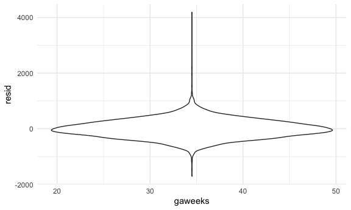
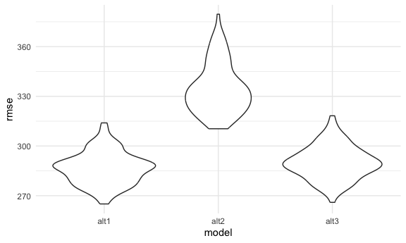

p8105_hw6_sdc2157
================
Stephanie Calluori
2023-12-02

# Load packages and set seed

``` r
library(tidyverse)
library(modelr)
library(mgcv)
library(readr)

set.seed(1)
```

# Problem 1

Create a city_state variable (e.g. “Baltimore, MD”), and a binary
variable indicating whether the homicide is solved. Omit cities Dallas,
TX; Phoenix, AZ; and Kansas City, MO – these don’t report victim race.
Also omit Tulsa, AL – this is a data entry mistake. For this problem,
limit your analysis those for whom victim_race is white or black. Be
sure that victim_age is numeric.

closed by arrest (solved) is 1; unsolved (wihtout arrest, open) 0;
wanted to make numeric and binary

``` r
homicide_raw <- read_csv("data/homicide-data.csv", col_names = TRUE, na = c("", "NA", "Unknown"))
```

    ## Rows: 52179 Columns: 12
    ## ── Column specification ────────────────────────────────────────────────────────
    ## Delimiter: ","
    ## chr (8): uid, victim_last, victim_first, victim_race, victim_sex, city, stat...
    ## dbl (4): reported_date, victim_age, lat, lon
    ## 
    ## ℹ Use `spec()` to retrieve the full column specification for this data.
    ## ℹ Specify the column types or set `show_col_types = FALSE` to quiet this message.

``` r
homicide_clean <- homicide_raw |> 
  janitor::clean_names() |> 
  mutate(victim_age = as.numeric(victim_age)) |> 
  mutate(city_state = paste(city, state, sep = ", ")) |> 
  filter(!city_state %in% c("Tulsa, AL", "Dallas, TX", "Phoenix, AZ", "Kansas City, MO")) |> 
  filter(victim_race == "White" | victim_race == "Black") |> 
  mutate(
    victim_race = fct_relevel(victim_race, "White"),
    victim_sex = fct_relevel(victim_sex, "Female"),
    resolved = as.numeric(disposition == "Closed by arrest"))
```

For the city of Baltimore, MD, use the glm function to fit a logistic
regression with resolved vs unresolved as the outcome and victim age,
sex and race as predictors. Save the output of glm as an R object; apply
the broom::tidy to this object; and obtain the estimate and confidence
interval of the adjusted odds ratio for solving homicides comparing male
victims to female victims keeping all other variables fixed.

``` r
baltimore_df <- homicide_clean |> 
  filter(city_state == "Baltimore, MD")

fit_baltimore <- glm(resolved ~ victim_age + victim_sex + victim_race, data = baltimore_df, family = binomial())

fit_baltimore |> 
  broom::tidy(conf.int = TRUE) |> 
  rename(log_OR = estimate, log_conf_low = conf.low, log_conf_high = conf.high) |> 
  mutate(OR = exp(log_OR),
         conf_low = exp(log_conf_low),
         conf_high = exp(log_conf_high)) |> 
  select(term, OR, conf_low, conf_high, p.value) |> 
  knitr::kable(digits = 3)
```

| term             |    OR | conf_low | conf_high | p.value |
|:-----------------|------:|---------:|----------:|--------:|
| (Intercept)      | 3.164 |    1.998 |     5.057 |   0.000 |
| victim_age       | 0.993 |    0.987 |     1.000 |   0.043 |
| victim_sexMale   | 0.426 |    0.324 |     0.558 |   0.000 |
| victim_raceBlack | 0.431 |    0.305 |     0.606 |   0.000 |

In Baltimore, cases in which the victim is male have a 0.426 lower odds
of being solved compared to cases in which the victim is female. 95% CI
(0.324, 0.558)

Now run glm for each of the cities in your dataset, and extract the
adjusted odds ratio (and CI) for solving homicides comparing male
victims to female victims. Do this within a “tidy” pipeline, making use
of purrr::map, list columns, and unnest as necessary to create a
dataframe with estimated ORs and CIs for each city.

``` r
homicide_nest_df <- homicide_clean |> 
  select(city_state, everything()) |> 
  nest(.data = _, data = uid:resolved)

results <- homicide_nest_df |> 
  mutate(
    models = map(data, \(df) glm(resolved ~ victim_age + victim_sex + victim_race, data = df, family = binomial())),
    results = map(models, \(mod) broom::tidy(x = mod, conf.int = TRUE))
  ) |> 
  unnest(results) |> 
  rename(log_OR = estimate, log_conf_low = conf.low, log_conf_high = conf.high) |> 
  mutate(OR = exp(log_OR),
         conf_low = exp(log_conf_low),
         conf_high = exp(log_conf_high)) |> 
  select(city_state, term, OR, conf_low, conf_high) |> 
  filter(term == "victim_sexMale") |> 
  arrange(desc(OR))
```

Create a plot that shows the estimated ORs and CIs for each city.
Organize cities according to estimated OR, and comment on the plot.

``` r
results |> 
  mutate(city_state = forcats::fct_reorder(city_state, OR)) |> 
  ggplot(aes(x = city_state, y = OR)) +
  geom_point() +
  geom_errorbar(
    aes(x = city_state,
        ymin = conf_low,
        ymax = conf_high)
  ) +
  labs(
    title = "Adjusted OR for solving homicides comparing Male to Female victims in each city",
    x = "city_state",
    y = "estimated OR"
  ) +
  theme(axis.text.x = element_text(angle=90, vjust=1, hjust=1))
```


# Problem 2

## Load Central Park Weather Data

``` r
cp_weather_df <-
  rnoaa::meteo_pull_monitors(
    c("USW00094728"),
    var = c("PRCP", "TMIN", "TMAX"), 
    date_min = "2022-01-01",
    date_max = "2022-12-31") |>
  mutate(
    name = recode(id, USW00094728 = "CentralPark_NY"),
    tmin = tmin / 10,
    tmax = tmax / 10) |>
  select(name, id, everything())
```

    ## using cached file: /Users/stephaniecalluori/Library/Caches/org.R-project.R/R/rnoaa/noaa_ghcnd/USW00094728.dly

    ## date created (size, mb): 2023-09-28 10:20:07.929139 (8.524)

    ## file min/max dates: 1869-01-01 / 2023-09-30

strap (ie our bootstrap sample)

Use 5000 bootstrap samples and, for each bootstrap sample, produce
estimates of these two quantities. Plot the distribution of your
estimates, and describe these in words

``` r
cp_results <- cp_weather_df |> 
  modelr::bootstrap(n = 5000) |> 
  mutate(
    models = map(strap, \(df) lm(tmax ~ tmin + prcp, data = df)),
    results_1 = map(models, broom::tidy),
    results_2 = map(models, broom::glance)
    ) |> 
  unnest(results_1) |> 
  select(term, estimate, results_2) |> 
  unnest(results_2) |> 
  select(term, estimate, r.squared)
  
cp_results_tidy <- cp_results |> 
  pivot_wider(
    names_from = term,
    values_from = estimate
  ) |> 
  mutate(log_coefficients_mult = log(tmin * prcp))
```

    ## Warning: There was 1 warning in `mutate()`.
    ## ℹ In argument: `log_coefficients_mult = log(tmin * prcp)`.
    ## Caused by warning in `log()`:
    ## ! NaNs produced

for each model, we have an r.squared value, an intercept, tmin, prcp,
and log_coefficients_mult

r^2 distribution

``` r
cp_results_tidy |> 
  ggplot(aes(x = r.squared)) +
  geom_density()
```


r^2 distribution = partially left skewed. centers around 0.92. about 92%
of the variation in tmax can be explained by the linear relationship
between tmax and tmin + prcp

``` r
cp_results_tidy |> 
  filter(log_coefficients_mult == "NaN") |> 
  nrow()
```

    ## [1] 3361

``` r
cp_results_tidy |> 
  filter(log_coefficients_mult != "NaN") |> 
  ggplot(aes(x = log_coefficients_mult)) +
  geom_density()
```


noted total number of NAs produced; filtered them out for the
distribution

log of product of coefficients distribution = centers around -5.5; What
does this mean? left skew

Using the 5000 bootstrap estimates, identify the 2.5% and 97.5%
quantiles to provide a 95% confidence interval for r̂ 2 and log(β̂ 0∗β̂ 1)
.

``` r
cp_results_tidy |> 
  select(r.squared, log_coefficients_mult) |> 
  pivot_longer(
    r.squared:log_coefficients_mult,
    names_to = "term",
    values_to = "estimate"
  ) |> 
  group_by(term) |> 
  summarize(
    ci_lower = quantile(estimate, 0.025, na.rm = TRUE),
    ci_upper = quantile(estimate, 0.975, na.rm = TRUE))
```

    ## # A tibble: 2 × 3
    ##   term                  ci_lower ci_upper
    ##   <chr>                    <dbl>    <dbl>
    ## 1 log_coefficients_mult   -8.98    -4.60 
    ## 2 r.squared                0.889    0.941

# Problem 3

there are no actual values of unknown for frace and no actual values of
other for mrace so removed those from the fct levels no NA values
present birthweight is a continuous outcome so use lm instead of glm

going with model 4

HOW TO USE ADD PREDICTIONS???

``` r
birthweight_raw <- read_csv("data/birthweight.csv", col_names = TRUE)
```

    ## Rows: 4342 Columns: 20
    ## ── Column specification ────────────────────────────────────────────────────────
    ## Delimiter: ","
    ## dbl (20): babysex, bhead, blength, bwt, delwt, fincome, frace, gaweeks, malf...
    ## 
    ## ℹ Use `spec()` to retrieve the full column specification for this data.
    ## ℹ Specify the column types or set `show_col_types = FALSE` to quiet this message.

``` r
birthweight_clean <- birthweight_raw |> 
  mutate(babysex = recode(
    babysex,
    "1" = "male",
    "2" = "female"),
    frace = recode(
      frace,
      "1" = "White",
      "2" = "Black",
      "3" = "Asian",
      "4" = "Puerto Rican",
      "8" = "Other",
      "9" = "Unknown"),
    mrace = recode(
      mrace,
      "1" = "White",
      "2" = "Black",
      "3" = "Asian",
      "4" = "Puerto Rican",
      "8" = "Other"),
    malform = recode(
      malform,
      "0" = "absent",
      "1" = "present")
    ) |> 
  mutate(
    babysex = forcats::fct_relevel(babysex, c("male", "female")),
    frace = forcats::fct_relevel(frace, c("White", "Black", "Asian", "Puerto Rican", "Other")),
    mrace = forcats::fct_relevel(mrace, c("White", "Black", "Asian", "Puerto Rican")),
    malform = forcats::fct_relevel(malform, c("absent", "present"))
  )

sum(is.na(birthweight_clean))
```

    ## [1] 0

``` r
str(birthweight_clean)
```

    ## tibble [4,342 × 20] (S3: tbl_df/tbl/data.frame)
    ##  $ babysex : Factor w/ 2 levels "male","female": 2 1 2 1 2 1 2 2 1 1 ...
    ##  $ bhead   : num [1:4342] 34 34 36 34 34 33 33 33 36 33 ...
    ##  $ blength : num [1:4342] 51 48 50 52 52 52 46 49 52 50 ...
    ##  $ bwt     : num [1:4342] 3629 3062 3345 3062 3374 ...
    ##  $ delwt   : num [1:4342] 177 156 148 157 156 129 126 140 146 169 ...
    ##  $ fincome : num [1:4342] 35 65 85 55 5 55 96 5 85 75 ...
    ##  $ frace   : Factor w/ 5 levels "White","Black",..: 1 2 1 1 1 1 2 1 1 2 ...
    ##  $ gaweeks : num [1:4342] 39.9 25.9 39.9 40 41.6 ...
    ##  $ malform : Factor w/ 2 levels "absent","present": 1 1 1 1 1 1 1 1 1 1 ...
    ##  $ menarche: num [1:4342] 13 14 12 14 13 12 14 12 11 12 ...
    ##  $ mheight : num [1:4342] 63 65 64 64 66 66 72 62 61 64 ...
    ##  $ momage  : num [1:4342] 36 25 29 18 20 23 29 19 13 19 ...
    ##  $ mrace   : Factor w/ 4 levels "White","Black",..: 1 2 1 1 1 1 2 1 1 2 ...
    ##  $ parity  : num [1:4342] 3 0 0 0 0 0 0 0 0 0 ...
    ##  $ pnumlbw : num [1:4342] 0 0 0 0 0 0 0 0 0 0 ...
    ##  $ pnumsga : num [1:4342] 0 0 0 0 0 0 0 0 0 0 ...
    ##  $ ppbmi   : num [1:4342] 26.3 21.3 23.6 21.8 21 ...
    ##  $ ppwt    : num [1:4342] 148 128 137 127 130 115 105 119 105 145 ...
    ##  $ smoken  : num [1:4342] 0 0 1 10 1 0 0 0 0 4 ...
    ##  $ wtgain  : num [1:4342] 29 28 11 30 26 14 21 21 41 24 ...

``` r
fit_1 = lm(bwt ~ gaweeks, data = birthweight_clean)
fit_2 = lm(bwt ~ gaweeks + bhead, data = birthweight_clean)
fit_3 = lm(bwt ~ gaweeks + bhead + blength, data = birthweight_clean)

fit_4 = lm(bwt ~ gaweeks + bhead + blength + babysex, data = birthweight_clean)
fit_5 = lm(bwt ~ gaweeks + bhead + blength + malform, data = birthweight_clean)

anova(fit_1, fit_2) |> 
  broom::tidy()
```

    ## # A tibble: 2 × 7
    ##   term                  df.residual        rss    df     sumsq statistic p.value
    ##   <chr>                       <dbl>      <dbl> <dbl>     <dbl>     <dbl>   <dbl>
    ## 1 bwt ~ gaweeks                4340 945200751.    NA   NA            NA       NA
    ## 2 bwt ~ gaweeks + bhead        4339 480826672.     1    4.64e8     4191.       0

``` r
anova(fit_2, fit_3) |> 
  broom::tidy()
```

    ## # A tibble: 2 × 7
    ##   term                     df.residual    rss    df   sumsq statistic    p.value
    ##   <chr>                          <dbl>  <dbl> <dbl>   <dbl>     <dbl>      <dbl>
    ## 1 bwt ~ gaweeks + bhead           4339 4.81e8    NA NA            NA  NA        
    ## 2 bwt ~ gaweeks + bhead +…        4338 3.55e8     1  1.26e8     1535.  1.05e-287

``` r
anova(fit_3, fit_4) |> 
  broom::tidy()
```

    ## # A tibble: 2 × 7
    ##   term                       df.residual    rss    df   sumsq statistic  p.value
    ##   <chr>                            <dbl>  <dbl> <dbl>   <dbl>     <dbl>    <dbl>
    ## 1 bwt ~ gaweeks + bhead + b…        4338 3.55e8    NA NA           NA   NA      
    ## 2 bwt ~ gaweeks + bhead + b…        4337 3.54e8     1  1.17e6      14.3  1.58e-4

``` r
anova(fit_3, fit_5) |> 
  broom::tidy()
```

    ## # A tibble: 2 × 7
    ##   term                         df.residual    rss    df  sumsq statistic p.value
    ##   <chr>                              <dbl>  <dbl> <dbl>  <dbl>     <dbl>   <dbl>
    ## 1 bwt ~ gaweeks + bhead + ble…        4338 3.55e8    NA    NA     NA      NA    
    ## 2 bwt ~ gaweeks + bhead + ble…        4337 3.55e8     1 21962.     0.268   0.605

``` r
birthweight_clean |> 
  modelr::add_residuals(fit_4) |> 
  modelr::add_predictions(fit_4) |> 
  ggplot(aes(x = pred, y = resid)) + 
  geom_point()
```


``` r
#fit_4 = lm(bwt ~ gaweeks + bhead + blength + babysex, data = birthweight_clean)
fit_alt1 = lm(bwt ~ gaweeks + blength, data = birthweight_clean)
fit_alt2 = lm(bwt ~ blength * bhead * babysex, data = birthweight_clean)

fit_alt2 |> 
  broom::tidy()
```

    ## # A tibble: 8 × 5
    ##   term                         estimate std.error statistic      p.value
    ##   <chr>                           <dbl>     <dbl>     <dbl>        <dbl>
    ## 1 (Intercept)                 -7177.     1265.       -5.67  0.0000000149
    ## 2 blength                       102.       26.2       3.90  0.0000992   
    ## 3 bhead                         182.       38.1       4.78  0.00000184  
    ## 4 babysexfemale                6375.     1678.        3.80  0.000147    
    ## 5 blength:bhead                  -0.554     0.780    -0.710 0.478       
    ## 6 blength:babysexfemale        -124.       35.1      -3.52  0.000429    
    ## 7 bhead:babysexfemale          -198.       51.1      -3.88  0.000105    
    ## 8 blength:bhead:babysexfemale     3.88      1.06      3.67  0.000245

``` r
birthweight_clean |> 
  modelr::add_residuals(fit_alt1) |> 
  ggplot(aes(x = gaweeks, y = resid)) + geom_violin()
```



``` r
birthweight_clean |> 
  modelr::add_residuals(fit_alt1) |> 
  ggplot(aes(x = blength, y = resid)) + geom_violin()
```


``` r
birthweight_clean |> 
  modelr::add_residuals(fit_alt2) |> 
  ggplot(aes(x = blength, y = resid)) + geom_violin()
```


``` r
birthweight_clean |> 
  modelr::add_residuals(fit_alt2) |> 
  ggplot(aes(x = bhead, y = resid)) + geom_violin()
```


``` r
birthweight_clean |> 
  modelr::add_residuals(fit_alt2) |> 
  ggplot(aes(x = babysex, y = resid)) + geom_violin()
```


``` r
cv_df <-
  crossv_mc(birthweight_clean, 100) |> 
  mutate(
    train = map(train, as_tibble),
    test = map(test, as_tibble))

cv_df <-
  cv_df |> 
  mutate(
    mod_alt1  = map(train, \(df) lm(bwt ~ gaweeks + bhead + blength + babysex, data = df)),
    mod_alt2  = map(train, \(df) lm(bwt ~ gaweeks + blength, data = df)),
    mod_alt3  = map(train, \(df) lm(bwt ~ blength * bhead * babysex, data = df))) |> 
  mutate(
    rmse_alt1 = map2_dbl(mod_alt1, test, \(mod, df) rmse(model = mod, data = df)),
    rmse_alt2 = map2_dbl(mod_alt2, test, \(mod, df) rmse(model = mod, data = df)),
    rmse_alt3 = map2_dbl(mod_alt3, test, \(mod, df) rmse(model = mod, data = df)))


cv_df |> 
  select(rmse_alt1, rmse_alt2, rmse_alt3) |> 
  pivot_longer(
    everything(),
    names_to = "model", 
    values_to = "rmse",
    names_prefix = "rmse_") |> 
  mutate(model = fct_inorder(model)) |> 
  ggplot(aes(x = model, y = rmse)) + 
  geom_violin()
```


choose alt1

models they gave us just do lm. compare rmse

predictions on x axis and resid on y axis; good b/c points center around
0 indicating a good fit; and there’s no clear pattern so linear is ok
